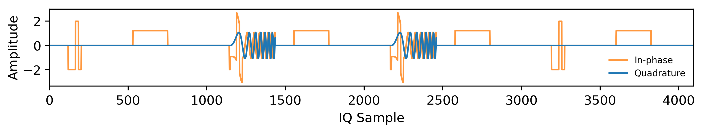
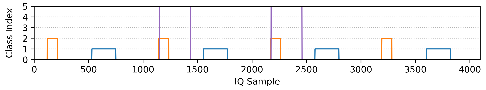

[](https://arxiv.org/abs/2312.09489) [](https://www.kaggle.com/datasets/abcxyzi/radseg-icassp-2024) [](https://creativecommons.org/licenses/by-nc-sa/4.0/)

# Radar Segmentation Dataset (RadSeg)

RadSeg is a synthetic radar dataset designed for building semantic segmentation models for radar activity recognition. Unlike existing radio classification datasets that only provide signal-wise annotations for short and isolated IQ sequences, RadSeg provides sample-wise annotations for interleaved radar pulse activities that extend across a long time horizon. This makes RadSeg the first annotated public dataset of its kind for radar activity recognition. This dataset is released to the public under the MIT License.

You can access the arXiv paper 📄 here: [https://arxiv.org/abs/2312.09489](https://arxiv.org/abs/2312.09489)

You can access the official paper 📄 here: [https://ieeexplore.ieee.org/document/10445810](https://ieeexplore.ieee.org/document/10445810)

> Z. Huang, A. Pemasiri, S. Denman, C. Fookes and T. Martin, "Multi-Stage Learning for Radar Pulse Activity Segmentation," ICASSP 2024 - 2024 IEEE International Conference on Acoustics, Speech and Signal Processing (ICASSP), Seoul, Korea, Republic of, 2024, pp. 7340-7344, doi: 10.1109/ICASSP48485.2024.10445810.

## Quick Links

- [Dataset Details](#dataset-details)
- [Dataloader Example](#radseg-dataloader)
- [Download Links](#download-links)
- [Extracting Dataset Parts](#extracting-dataset-parts)
- [Citation](#citation)

## Dataset Details

RadSeg contains pulsed radar signals at varying signal-to-noise ratios (SNRs) between -20 to 20 dB with a resolution of 0.5 dB. This repository provides the RadSeg dataset which consists of three parts:

- `RadSeg-Train` contains 60,000 radar signals for model training;
- `RadSeg-Valadation` contains 10,000 radar signals for model validation; and
- `RadSeg-Test` contains 10,000 radar signals held out for testing.

⚙️ This dataset comprises a total of 5 radar signal types, which include: 
- Barker codes, up to a code length of 13;
- Polyphase Barker codes, up to a code length of 13;
- Frank codes, up to a code length of 16;
- Linear frequency-modulated (LFM) pulses; and 
- Coherent unmodulated pulse trains. 

Integer mapping of class labels are given below:

```python
# Number of signal classes
num_classes = 5

# Channel class indices, note the shape of a batch is therefore [batch_size, 6, sequence_len]
seg_classes = {
    "0": "noise", # Noise channel not used for training
    "1": "cpt",
    "2": "barker",
    "3": "polyphase",
    "4": "frank",
    "5": "lfm"
}
```

⚙️ Additional dataset characteristics:
- The sampling rate used in RadSeg is 3.2 MHz. 
- Each radar signal contains 32,768 complex, baseband IQ samples. Note, we use a subdivision of the total available samples in our ICASSP paper as part of our data augmentation workflow.
- Annotations are provided as channel-wise binary masks where each channel corresponds to a signal type.

Please refer to our [conference paper](https://ieeexplore.ieee.org/document/10445810) for additional details on RadSeg.

### RadSeg Frame

Visualisation of a frame from RadSeg:



Example of the corresponding segmentation mask:



## RadSeg Dataloader

To easily work with RadSeg, please feel free to use or adapt the data module in `dataset.py`. Below is an example workflow for creating train, validation, and test dataloaders using PyTorch:

```python
# Root
DATA_PATH = {
    "TRAIN_DATA_PATH": "./RadSeg/train", # NOTE: Replace this as required
    "VAL_DATA_PATH": "./RadSeg/val", 
    "TEST_DATA_PATH": "./RadSeg/test"
}

# Configs
sampler=True, 
sample_window=int(4096), # Used in our ICASSP paper 
subdivision=2, # Augmentation used in our ICASSP paper
enable_mtl=False # NOTE: Not publicly available yet, but hopefully soon...

# Make train set
train_set = RadSegDataset(
    data_path=data_path["TRAIN_DATA_PATH"], 
    sampler=sampler, 
    sample_window=sample_window, 
    is_train=True,
    subdivision=subdivision,
    enable_mtl=enable_mtl
)

# Compute norm params using train set stats
train_norm_params = {
    "mu": train_set.signals_mu, # Mu is a complex number 
    "mu_real": np.real(train_set.signals_mu), 
    "mu_imag": np.imag(train_set.signals_mu),
    "var": train_set.signals_var
}

# Make validation set and test set
val_set, test_set = \
    RadSegDataset(
        data_path=data_path["VAL_DATA_PATH"], 
        sampler=sampler, 
        sample_window=sample_window, 
        is_train=False,
        normalisation_params=train_norm_params, 
        subdivision=subdivision,
        enable_mtl=enable_mtl
    ), \
    RadSegDataset(
        data_path=data_path["TEST_DATA_PATH"], 
        sampler=sampler, 
        sample_window=sample_window, 
        is_train=False,          
        normalisation_params=train_norm_params, 
        subdivision=subdivision,
        enable_mtl=enable_mtl
    )
```

## Download Links

The official RadSeg dataset can be downloaded from [Kaggle](https://www.kaggle.com/datasets/abcxyzi/radseg-icassp-2024). The total size of the combined datasets is approximately `156 GB`. RadSeg contains the following parts:

### Raw IQ Data

- `RadSeg-IQ-Train` - approx. file size of 29.3 GB
- `RadSeg-IQ-Validation` - approx. file size of 4.9 GB
- `RadSeg-IQ-Test` - approx. file size of 4.9 GB

### Segmentation Masks (Channel-wise Annotations)

- `RadSeg-Masks-Train` - approx. file size of 87.9 GB
- `RadSeg-Masks-Validation` - approx. file size of 14.6 GB
- `RadSeg-Masks-Test` - approx. file size of 14.6 GB

### SNR Labels

- `RadSeg-SNR-Train` - approx. file size of 470.8 KB
- `RadSeg-SNR-Validation` - approx. file size of 80.1 KB
- `RadSeg-SNR-Test` - approx. file size of 80.1 KB

### Downloaded Files

Note, due to its large file size, RadSeg has been compressed and split into multiple parts:

- `RadSeg_Train` contains 10 `RadSegTrain.tar.part-*` files
- `RadSeg_Val` contains 5 `RadSegVal.tar.part-*` files
- `RadSeg_Test` contains 5 `RadSegTest.tar.part-*` files

⚙️ The train, validation, and test sets each contain three `HDF5` files:

1. `radseg_iq.hdf5` contains the raw I/Q data
2. `radseg_labels.hdf5` contains the segmentation masks
3. `radseg_snrs.hdf5` contains the SNR labels 

## Extracting Dataset Parts

> There should be a total of 20 downloadable `tar` files. These files will need to be extracted and re-combined to obtain the original datasets.

To extract and combine multiple parts of the dataset, for example:

```bash
# We want to re-combine these parts into a single "RadSegTest.tar" file
RadSegTest.tar.part-aa
RadSegTest.tar.part-ab
RadSegTest.tar.part-ac
RadSegTest.tar.part-ad
RadSegTest.tar.part-ae
```

Download the individual parts to a local directory, then run the following commands in this order:

```bash
# Go to RadSeg_Test
cd ./RadSeg_Test

# Combine the individual parts into a single .tar.gz archive
cat RadSegTest.tar.part-* > RadSegTest.tar.gz

# Unpack the .tar.gz archive to retrieve the dataset
tar -xzf RadSegTest.tar.gz
```

## Citation

💡 Please cite both the dataset and the conference paper if you find them helpful for your research. Cheers.

```latex
@inproceedings{huang2024radseg,
  author    = {Zi Huang and Akila Pemasiri and Simon Denman and Clinton Fookes and Terrence Martin},
  title     = {Multi-Stage Learning for Radar Pulse Activity Segmentation},
  booktitle = {Proceedings of the IEEE International Conference on Acoustics, Speech and Signal Processing (ICASSP)},
  year      = {2024},
  pages     = {7340--7344},
  doi       = {10.1109/ICASSP48485.2024.10445810},
  keywords  = {Radar, Speech recognition, Radar countermeasures, Radio communication countermeasures, Task analysis, Speech processing, Signal to noise ratio, Multi-stage learning, Activity segmentation, Radio signal recognition, Deinterleaving, Radar dataset}
}
```